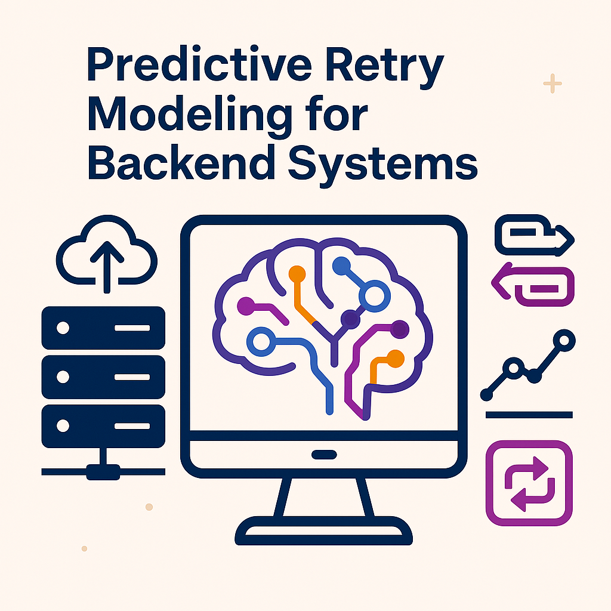

# Load Balancer Analytics at Hyperscale

[](https://fr.linkedin.com/in/fares-chehidi-89a31333a)
[](mailto:fareschehidi28@gmail.com)

**Enterprise-grade load balancer observability platform with ML-powered retry prediction, real-time analytics, SQL Server integration, and Power BI dashboards for high-scale traffic management.**

## 📋 Quick Overview

This repository contains two complementary projects that together provide a comprehensive solution for load balancer monitoring, analytics, and intelligent optimization:

### 🔍 [Load Balancer Observability Dashboard](load-balancer-observability-dashboard/)
Real-time monitoring and analytics platform for load balancer infrastructure with:
- Live telemetry processing and visualization
- Comprehensive KPI computation and anomaly detection  
- SQL Server data warehousing with enterprise-grade performance
- Power BI dashboard integration for executive and operational views
- Automated alerting and notification systems

### 🤖 [Load Balancer Retry Prediction](load-balancer-retry-prediction/)
Machine learning solution for predicting client retry behavior with:
- Predictive analytics for client retry patterns
- Production-ready API for real-time predictions
- Business impact analysis and ROI quantification
- Integration patterns for existing load balancer infrastructure
- Comprehensive model documentation and validation

## 🚀 Quick Start

### Prerequisites
- Python 3.8+
- SQL Server or SQL Server Express
- ODBC Driver 17 for SQL Server

### Installation
```bash
# Clone the repository
git clone https://github.com/FCHEHIDI/Load-Balancer-Analytics-at-Hyperscale.git
cd Load-Balancer-Analytics-at-Hyperscale

# Setup observability dashboard
cd load-balancer-observability-dashboard
pip install -r requirements.txt

# Configure database credentials
cp .env.template .env
# Edit .env with your SQL Server credentials

# Run the pipeline
python src/observability_orchestrator.py
```

### Verify Installation
```bash
# Run integration tests
python test_integration.py
```

## 📊 Key Features

- **Real-time Monitoring**: Live telemetry processing from load balancers
- **Predictive Analytics**: ML-powered retry behavior prediction
- **Enterprise Integration**: SQL Server data warehousing
- **Executive Dashboards**: Power BI integration for stakeholder views
- **Scalable Architecture**: Designed for high-volume production environments
- **Secure Configuration**: Environment-based credential management

## 🔧 Configuration

### Database Setup
1. Copy `.env.template` to `.env` in the observability dashboard directory
2. Configure your SQL Server credentials:
   ```env
   DB_SERVER=YOUR_SERVER_NAME
   DB_DATABASE=TrafficInsights
   DB_AUTH_TYPE=Windows Authentication
   DB_USERNAME=YOUR_DOMAIN\YOUR_USERNAME
   ```

**Security Note**: The `.env` file contains sensitive credentials and is excluded from version control.

## 📖 Documentation

- **[Complete Project Overview](PROJECT_OVERVIEW.md)** - Detailed architecture and integration guide
- **[Observability Dashboard Guide](load-balancer-observability-dashboard/README.md)** - Setup and usage instructions
- **[Retry Prediction Guide](load-balancer-retry-prediction/README.md)** - ML model documentation
- **[Database Setup Guide](load-balancer-observability-dashboard/DATABASE_SETUP.md)** - Database configuration instructions
- **[Power BI Dashboard (PDF)](load-balancer-observability-dashboard/dashboards/Load%20Balancer%20Dashboard.pdf)** - Dashboard preview (no Power BI required)

## 🏗️ Architecture



The system provides end-to-end telemetry processing from data ingestion through analytics to actionable insights via dashboards and APIs.

## 🧪 Testing

Run the comprehensive test suite:
```bash
# Integration tests
python test_integration.py

# Individual component tests
cd load-balancer-observability-dashboard
python src/data_generation.py
python src/dashboard_engine.py
```

## 📈 Use Cases

### Operations Teams
- Real-time infrastructure monitoring
- Incident response and troubleshooting
- Performance optimization insights

### Management Teams  
- Executive dashboards and reporting
- Capacity planning and forecasting
- Business impact analysis

### Development Teams
- API integration for retry prediction
- Circuit breaker optimization
- Intelligent traffic routing

## 🤝 Contributing

This project is designed for enterprise load balancer environments. For contributions or questions:

- **Author**: Fares Chehidi
- **Email**: fareschehidi28@gmail.com
- **LinkedIn**: [Connect with me](https://fr.linkedin.com/in/fares-chehidi-89a31333a)

## 📄 License

This project is licensed under the MIT License - see the [LICENSE](LICENSE) files in each project directory for details.

## 🔗 Related Projects

- [Load Balancer Observability Dashboard](load-balancer-observability-dashboard/) - Real-time monitoring platform
- [Load Balancer Retry Prediction](load-balancer-retry-prediction/) - ML prediction system

---

**Ready to transform your load balancer monitoring?** Start with the [Quick Start](#-quick-start) guide above!
