# Architecture Overview

## Load Balancer Observability Dashboard System Architecture

This document provides a comprehensive overview of the technical architecture for the load balancer observability and analytics platform.

## System Components

### 1. Data Generation Layer (`src/data_generation.py`)

**Purpose**: Generate synthetic load balancer telemetry data for testing and demonstration.

**Key Features**:
- Realistic traffic pattern simulation
- Regional distribution modeling
- Anomaly injection for testing
- Configurable data volume and time ranges

**Data Types Generated**:
- Request logs with timestamps, response times, status codes
- Server metrics with CPU, memory, network utilization
- Client retry patterns and failure scenarios

### 2. Analytics Engine (`src/dashboard_engine.py`)

**Purpose**: Process raw telemetry data and compute business-relevant KPIs.

**Key Features**:
- Real-time KPI computation
- Anomaly detection algorithms
- Traffic pattern analysis
- Performance threshold monitoring

**Output Metrics**:
- Request volume and latency statistics
- Error rates and retry patterns
- Server health and utilization
- Regional performance distribution

### 3. Data Warehouse (`src/sql_injector.py`)

**Purpose**: Provide enterprise-grade data storage and retrieval.

**Key Features**:
- Automated schema management
- Batch data insertion with transaction safety
- Performance optimization with indexing
- Data retention policies

**Database Schema**:
- `RequestLogs`: Individual request telemetry
- `ServerMetrics`: Server performance data
- `AnalyticsReports`: Computed KPI reports
- `DataQualityMetrics`: Data validation results

### 4. Orchestration Layer (`src/observability_orchestrator.py`)

**Purpose**: Coordinate the complete observability pipeline.

**Key Features**:
- End-to-end workflow management
- Error handling and retry logic
- Performance monitoring
- Health checking and validation

## Data Flow Architecture

The following Mermaid diagram illustrates the complete data flow from generation through processing to final delivery via Power BI dashboards:

```mermaid
flowchart LR
    %% External Data Sources (Optional)
    subgraph EXTERNAL["🌐 External Sources (Optional)"]
        direction TB
        LB["Load Balancers
        Live telemetry"]
        INFRA["Infrastructure
        Server metrics"]
    end
    
    %% Data Generation
    subgraph GENERATION["🔄 Data Generation"]
        DG["Data Generator
        (data_generation.py)
        
        • Synthetic data creation
        • Data augmentation
        • CSV file generation"]
    end
    
    %% Intermediate Files
    subgraph FILES["📁 Intermediate Files"]
        direction TB
        CSV["CSV Files
        request_logs.csv
        server_metrics.csv"]
        JSON["JSON Files
        analytics_report.json"]
    end
    
    %% Analytics Processing
    subgraph ANALYTICS["⚙️ Analytics Processing"]
        AE["Analytics Engine
        (dashboard_engine.py)
        
        • KPI computation
        • Anomaly detection
        • Report generation"]
    end
    
    %% Central Hub - SQL Injector
    subgraph CENTRAL["🎯 SQL Injector - CENTRAL HUB"]
        SI["SQL Injector
        (sql_injector.py)
        
        KEY COMPONENT
        • Ingests CSV/JSON files
        • Schema management
        • Batch data insertion
        • Data warehousing"]
    end
    
    %% SQL Server Database
    subgraph DATABASE["🗄️ SQL Server"]
        DB["TrafficInsights DB
        
        • RequestLogs table
        • ServerMetrics table
        • AnalyticsReports table"]
    end
    
    %% Power BI - Main Deliverable
    subgraph POWERBI["📊 Power BI - MAIN DELIVERABLE"]
        PBI["Dashboard System
        
        PRIMARY OUTPUT
        • Real-time monitoring
        • Executive reports
        • Operational dashboards"]
    end
    
    %% Orchestration
    subgraph ORCHESTRATION["🎼 Pipeline Orchestration"]
        OO["Orchestrator
        (observability_orchestrator.py)
        
        • Workflow coordination
        • Error handling
        • Health monitoring"]
    end
    
    %% LINEAR DATA FLOW
    EXTERNAL -.->|Optional| DG
    DG --> CSV
    DG --> JSON
    CSV --> AE
    JSON --> AE
    AE --> SI
    SI --> DB
    DB --> PBI
    
    %% Orchestration oversight
    OO -.-> DG
    OO -.-> AE
    OO -.-> SI
```

### Key Architecture Highlights

1. **Data Generation**:
   - **Data Generator** creates synthetic telemetry data
   - Optionally ingests data from external load balancers and infrastructure
   - Outputs structured **CSV files** (request_logs.csv, server_metrics.csv)

2. **Analytics Processing**:
   - **Analytics Engine** reads CSV files
   - Computes KPIs, detects anomalies, generates insights
   - Produces **JSON reports** (analytics_report.json)

3. **Central Data Warehousing** (Key Component):
   - **SQL Injector** serves as the central hub
   - Ingests both CSV files and JSON analytics reports
   - Manages database schema and performs batch insertions
   - Stores everything in **SQL Server TrafficInsights database**

4. **Primary Deliverable**:
   - **Power BI Dashboard** connects directly to SQL Server
   - Provides real-time monitoring and executive reporting
   - Serves as the main system deliverable and monitoring tool

#### 🎯 **SQL Injector Central Role:**
- **Data Gateway**: All processed data flows through this component
- **Schema Manager**: Handles database structure and optimization
- **Data Validator**: Ensures data quality and integrity
- **Performance Optimizer**: Manages batch processing and indexing
- **Transaction Controller**: Maintains data consistency and safety

#### 📊 **Power BI Dashboard as Primary Deliverable:**
The Power BI Dashboard represents the **main system deliverable** and serves as:
- **Executive Monitoring Tool**: Real-time KPIs for management oversight
- **Operational Command Center**: Live monitoring for operations teams
- **Performance Analytics**: Trend analysis and capacity planning
- **Alert Dashboard**: Visual notifications for system anomalies
- **Business Intelligence**: Data-driven decision support

### Architecture Flow Summary

#### 🎼 **Orchestration Layer**
The Observability Orchestrator manages the entire pipeline, ensuring:
- Seamless workflow coordination between components
- Error handling and recovery procedures
- System health monitoring and validation
- Performance optimization across the pipeline

## Technical Stack

### Core Technologies
- **Python 3.8+**: Primary development language
- **pandas**: Data manipulation and analysis
- **SQL Server**: Enterprise data warehouse
- **Power BI**: Visualization and dashboards
- **pyodbc**: Database connectivity

### Data Processing
- **NumPy**: Numerical computing
- **SciPy**: Statistical analysis
- **Matplotlib/Seaborn**: Data visualization
- **SQLAlchemy**: Database abstraction

### Infrastructure
- **Windows Server**: Deployment platform
- **SQL Server Express**: Development database
- **ODBC Driver 17**: Database connectivity
- **IIS**: Web server hosting

## Performance Characteristics

### Data Processing
- **Throughput**: 10,000+ requests/second
- **Latency**: Sub-second analytics processing
- **Scalability**: Handles 100M+ records
- **Reliability**: 99.9% uptime target

### Dashboard Performance
- **Refresh Rate**: 30-second intervals
- **Load Time**: <3 seconds for standard reports
- **Concurrent Users**: 50+ simultaneous viewers
- **Data Retention**: 90 days default

## Security Architecture

### Database Security
- **Authentication**: Windows integrated security
- **Encryption**: TLS 1.2 for data in transit
- **Access Control**: Role-based permissions
- **Audit Logging**: Complete transaction logs

### Application Security
- **Input Validation**: SQL injection prevention
- **Error Handling**: Secure error messages
- **Logging**: Comprehensive audit trails
- **Configuration**: Secure defaults

## Deployment Architecture

### Development Environment
- **Local SQL Server**: F2D2\\SQLEXPRESS
- **Development Database**: TrafficInsights
- **Python Virtual Environment**: Isolated dependencies
- **Debug Mode**: Detailed error reporting

### Production Environment
- **Clustered SQL Server**: High availability
- **Load Balanced Web Tier**: Horizontal scaling
- **Monitoring**: Application performance monitoring
- **Backup Strategy**: Automated data protection

## Monitoring and Observability

### System Monitoring
- **Health Checks**: Database connectivity
- **Performance Metrics**: Query execution times
- **Resource Usage**: CPU, memory, disk
- **Error Tracking**: Exception logging

### Business Monitoring
- **KPI Tracking**: Response times, error rates
- **Anomaly Detection**: Performance degradation
- **Trend Analysis**: Capacity planning
- **Alerting**: Threshold-based notifications

## Integration Points

### Data Sources
- **Load Balancer Logs**: Real-time telemetry
- **Server Metrics**: System performance data
- **Application Logs**: Error and event tracking
- **Network Monitoring**: Traffic analysis

### External Systems
- **SIEM Integration**: Security event correlation
- **Ticketing Systems**: Incident management
- **Monitoring Platforms**: Centralized alerting
- **Capacity Planning**: Resource optimization

## Scalability Considerations

### Horizontal Scaling
- **Database Sharding**: Data partitioning
- **Read Replicas**: Query distribution
- **Caching Layer**: Redis/Memcached
- **Load Balancing**: Traffic distribution

### Vertical Scaling
- **CPU Optimization**: Parallel processing
- **Memory Management**: Efficient data structures
- **Storage Optimization**: Compression and indexing
- **Network Optimization**: Bandwidth management

## Disaster Recovery

### Backup Strategy
- **Automated Backups**: Daily full backups
- **Transaction Log Backups**: 15-minute intervals
- **Offsite Storage**: Geographic redundancy
- **Recovery Testing**: Monthly validation

### Business Continuity
- **Failover Procedures**: Automated switching
- **Data Replication**: Real-time synchronization
- **Recovery Time Objective**: 4 hours
- **Recovery Point Objective**: 15 minutes

## Future Enhancements

### Short Term (3-6 months)
- **Real-time Streaming**: Apache Kafka integration
- **Machine Learning**: Predictive analytics
- **Mobile Dashboard**: Responsive design
- **API Gateway**: RESTful service layer

### Long Term (6-12 months)
- **Cloud Migration**: Azure/AWS deployment
- **Microservices**: Container orchestration
- **Advanced Analytics**: AI/ML capabilities
- **Multi-tenant**: SaaS architecture

## Contact Information

**Author**: Fares Chehidi  
**Email**: fareschehidi28@gmail.com  
**Documentation**: [Architecture Guide](architecture_overview.md)  
**Support**: [Support Portal](mailto:fareschehidi@gmail.com)

---

*This document is maintained as part of the load balancer observability platform documentation suite.*
